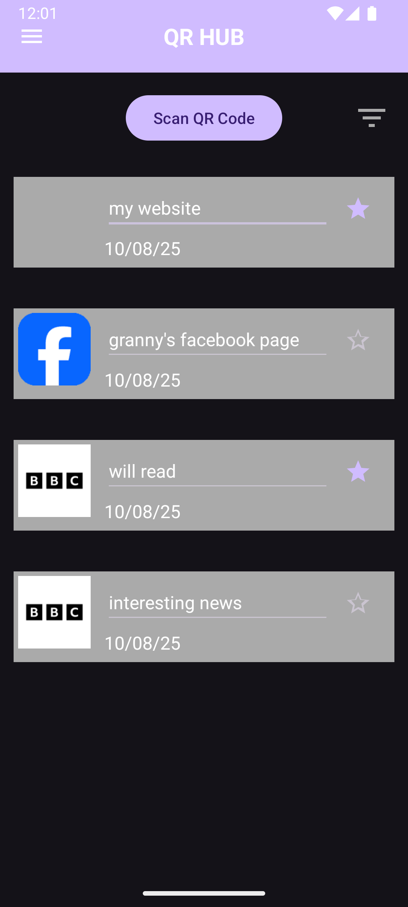

# QR Hub

Welcome to QR Hub, your personal QR code catalogue built for all your link related quick access and archiving needs.

---

## Contents
* [`AndroidApp`](AndroidApp) contains all the necessary project files for the Android application
* [`Images`](Images) includes screenshots and other media of the app
* [`LICENSE`](LICENSE.txt) entails the properties of this projects license
* [`Releases`](https://github.com/OzzyBozy/QRhub/releases) contains the files for downloading the app

---

## Features

- **QR Code Scanning**  
  Use the device camera to scan QR codes quickly.
- **QR Code Storage**  
  Save scanned QR codes locally with:
  - Decoded text/data
  - URL
  - Scan date & time
  - Favorite status
  - An image of the site
- **Display & Management**  
  - View all saved QR codes in a scrollable list
  - Editable QR code names
  - Mark/unmark as favorites
  - Tap to open URL in a browser or compatible app
  - Long-press to delete
- **Filtering & Sorting**  
  - Sort by date (most recent first)
  - Show only favorites
- **Favicon Fetching**  
  Automatically attempts to download and display the favicon for QR codes that contain URLs.
- **Data Persistence**  
  Stores all QR code details in shared preferences so they remain available between app sessions.

---

## Purpose

The main purpose of QR Hub is to provide a convenient and organized way to manage QR code data:

- **Quick Access** – Scan and save QR codes without needing a separate scanning app every time.
- **History & Organization** – Keep a searchable history of scanned codes.
- **Customization** – Rename QR entries, mark favorites, and view website favicons for quick identification.
- **Persistence** – Never lose important QR code data; it stays saved even after closing the app.

QR Hub acts as a personal database and quick access tool for any information captured via QR codes.

---

## Example
<table>
  <tr>
    <td align="center" width="25%">
      
<strong>UI preview</strong>

      
    </td>
  </tr>
</table>

---

## How to Build

| Build in Android Studio | Download APK for Android |
| --- | --- |
| Clone the repository: `git clone https://github.com/OzzyBozy/QRhub.git` | Download the `QRhub-(prefered version).apk` file from the [Releases](https://github.com/OzzyBozy/QRhub/releases) page. |
| Open the project in **Android Studio**. | Transfer or download the APK to your Android device via the link. |
| Let Gradle sync and resolve dependencies automatically. | Ensure that your device allows installation from unknown sources (Settings → Security → Unknown sources). |
| Click ▶️ to build and run either on your device or emulator. | Open the APK file to install the app. |

Done! Now you have either set up the project in Android Studio or installed the APK directly on your device.

---

## Contributing
Currently, this is a **single-developer-maintained project**.  
You are welcome to:

- Submit issues
- Suggest features
- Discuss bugs
- Help with translations
- Develop the app for other platforms

Direct commits to `main` are restricted so use Pull Requests if you wish to suggest change.

---

## License

The code is **open source** — but with important restrictions:

 ✅ You may use, modify, and redistribute the code for non-commercial purposes.  
 ✅ Proper credit to the author ("OzzyBozy") is always required.  
 ❌ **Commercial use is prohibited** unless written permission is granted.  
 ❌ Unauthorized monetization, repackaging, or selling is strictly forbidden.  

The full license text is available here: [LICENSE.txt](LICENSE.txt).

---
*Thank you for scanning QRhub.  
Enjoy your tailored QR catalogue.*
